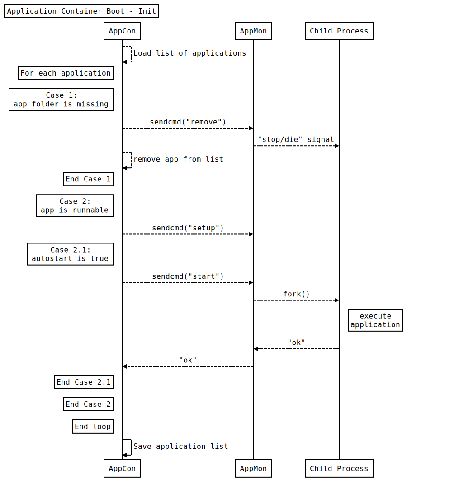
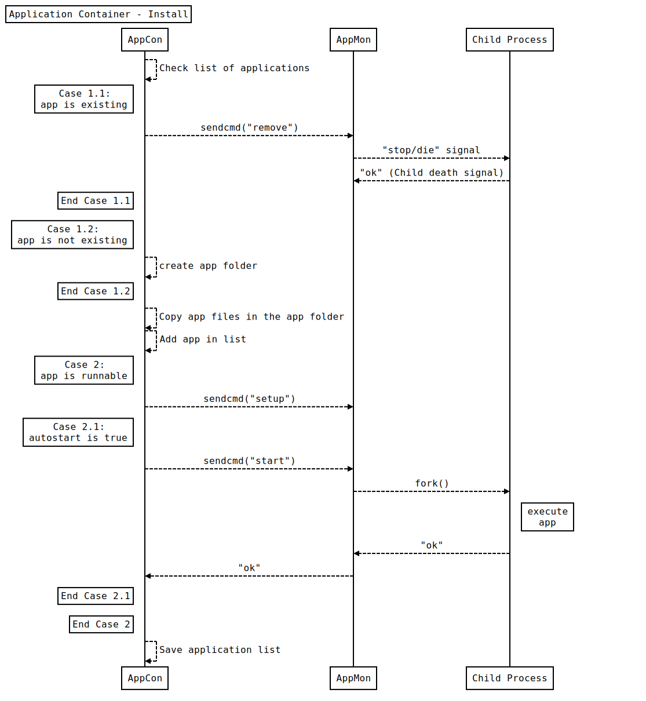
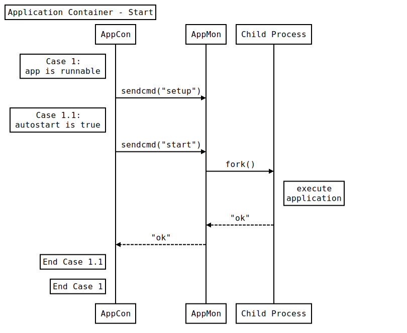
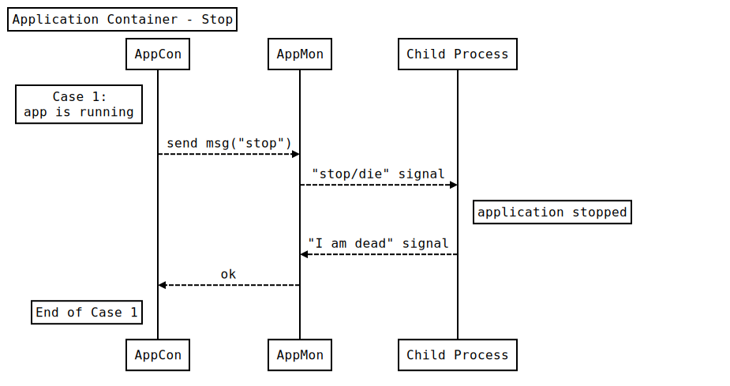

Application Container
=====================

The Application Container is a module of the Agent responsible for:

-   installing, uninstalling, starting, stopping applications;
-   automatically starting applications at Agent boot;
-   managing the execution cycle of installed applications.

1. Requirements
===============

-   Linux only
-   Need [Appmon Daemon](Appmon_Daemon.html) tool.
-   ApplicationContainer will create (if needed) a install directory in
    runtime/apps/application_id\
     Then it will copy the application data (the content of the folder
    given as parameter) to that install directory.

2. AppMon Daemon usage
======================

Application Container role : AppCon manages a list of applications. The
list is persisted. The Application Container needs to communicate with
AppMon by socket in order to send commands to it (ex : start, stop...).
\
The Application Container is not directly monitoring application life
circle, it uses Appmon so that application is monitored as needed.

Appmon Daemon role : AppMon is a tool which enables to monitor
application whose id name is sent by AppCon. This daemon does'nt
persist any application list, managed application have to be setup after
each boot (Application Container takes care of that).

Functional cases:

As Application Container receives a request to install an application,
the**install()** method will be called, it will check in the list if
this application is existing. If yes, Application Container will send
"remove" command to demand Appmon Daemon to delete the existing
application. Then it will save the new application in the list and call
**start()** function. The latter will send a "start" command with the id
name of application to Appmon Daemon which is in charge of starting the
application by creating a child process.

The child process is created by fork() operation, it will execute the
application. If the child process dies during its execution, it returns
a error code to its father process Appmon Daemon. Subsequently Appmon
Daemon will restart this child process again.

Sequence diagrams:

As the application container is starting, the "boot" sequences are
following :

As the application container receives a request to install an
application, the "install" sequences are following :

As the application container receives a request to start an application,
the "start" sequences are following :

\

As the application container receives a request to stop an application,
the "stop" sequences are following :

\

3. API
======

How to use the Application container:

#### 3.1. Install

~~~~ {.lua}
install(application_id, application_data, autostart, purge)
~~~~

-   application\_id: string identifying the application, if the id
    already exists, the previous application is **overwritten** by the
    new one.
-   application\_data: string, **must** be a **folder** located by its
    **absolute** path\
     This folder **may** contain an executable file named "**run**",
    this is the file that will be executed to start the application if
    you want it to be monitored.
-   autostart: boolean, used only if the application can be run.\
     When set to true, the Application Container will start the
    application automatically after installation and after Agent
    start up. nil or false value disable it.\
     Default value is no autostart.
-   purge: boolean, used only for application reinstall / overwrite.
    Default value is no purge.\
    When set to true, the application folder will be purged before
    reinstall, otherwise the folder is left unmodified. No purge means:
    -   new files coming from application\_data folder are copied into
        application runtime folder.
    -   existing files in application runtime folder are overwritten by
        the ones coming from application\_data folder:\
         the new file will always replace the existing one: whether the
        new one is a file or a folder, whether the old one is a file or
        a folder.\
         (e.g. a folder created by an application will be deleted if a
        new file has the same name/path as this folder during
        re-installation without purge).

> **INFO**
>
> -   The installation directory and installed files are created/copied
>    with 755 access rights.
> -   Only files, directories and links are supported for application
>    content. "Special" files like socket, named pipe, ... are not
>    supported.

*Application return code Vs application restart*:\
 Note: When the application has to be restarted, a delay will be applied
before actually restarting it.\
 Return code means system exit code:

-   0 to report success, then Application Container will **not** restart
    automatically the application
-   != 0 to report error, then Application Container will **restart**
    automatically the application

#### 3.2. Uninstall

~~~~{.lua}
uninstall(application_id)
~~~~

This will remove all the application and all data that have been
installed in the running directory of the application

#### 3.3. Start

~~~~{.lua}
start(application_id)
~~~~

Start an application that have already been added to the Application
list\
 If the application is not runnable, or the application is already
started, it has no effect.

> **INFO**
>
> The application is started with a specific Unix user. See [Appmon
> Daemon](Appmon_Daemon.html) documentation for more info.

#### 3.4. Stop

~~~~{.lua}
stop(application_id)
~~~~

To stop an application: this will send system signals to the
application:

-   TERM signal first, so that the application can clean its own stuff
-   KILL signal to stop it after X seconds.\
     If the application is not runnable, or the application is already
    stopped, it has no effect.

#### 3.5. Status

~~~~{.lua}
status(application_id)
~~~~

If the application is runnable, then it returns the status sent by
status command of appmon\_daemon (see appmon\_daemon doc) else only
returns "Not runnable"

#### 3.6. Configure

~~~~{.lua}
configure(application_id, autostart)
~~~~

Parameters:

-   application_id: string, unique id of the application to configure
-   autostart: boolean, replace the autostart parameter given at
    install.\
     if the application is not runnable, or the application is already
    stopped, it has no effect.

#### 3.7. List

~~~~{.lua}
list()
~~~~

Return a table with all the applications added to the
ApplicationContainer.\
 The table is like: { application_id={autostart=boolean,
runnable=boolean}, application_id={autostart=boolean,
runnable=boolean}, ...}.

#### 3.8. Init

~~~~{.lua}
init()
~~~~

To be called at Agent start up to start all registered applications
with autostart set to true.

4. Application Runnable status
==============================

An application is runnable if the installation folder contains an
executable file named "**run**".

The Runnable status of the application is computed when it is used:

-   at installation, to check if the application needs to be set up in
    Appmon\_Daemon, and started
-   at boot, to check if the application needs to be set up in
    Appmon\_Daemon, and started
-   when ApplicationContainer API is called (start, stop, configure,
    ...).

5. Examples
===========

See below an example of the executable file "**run**". Assuming your application is named "**sample_app_appcon**", \
you need to put this file into a folder of the same name and compress it to the zip format.

~~~~{.bash}
#!/bin/sh

APPNAME="SampleApp"

on_term()
{
  echo $APPNAME "Dying..."

  #you can remove the exit call to term that sigkill is send to kill app after some time
  # you can change the exit code to test the app is restarted
  exit 0
}

# Execute function on_term() receiving TERM signal
# The trap function seems not to be executed during a sleep

#trap 'on_term' TERM

while true
do  
  echo $APPNAME "pid:" $$ "date:" `date`
  sleep 5
done

# We never get here.
exit 1
~~~~

Once your application has been compressed, the archive should get a file tree like this one :

~~~~{.bash}
sample_app_appcon/
sample_app_appcon/run
~~~~

