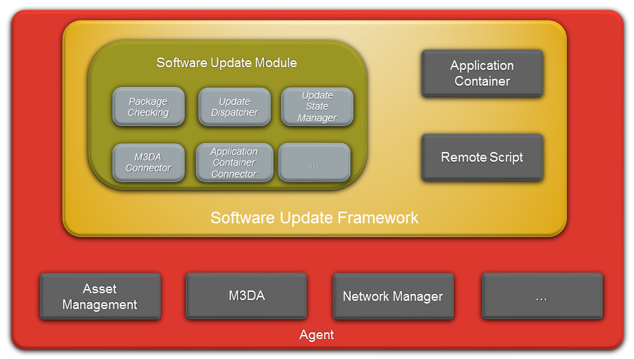

Software Update Framework
=========================

Small Description of each element:

-   [Software Update Module](Software_Update_Module.html): manages
    software list (with versions) of components, processes software
    update jobs
    -   [Software Update Package](Software_Update_Package.html):
        support, with component list management, version checking,
        multiple update in the same package with ordering information,
        ...

-   [Application Container](Application_Container.html): controls
    loading and monitoring of start-up applications
-   [Remote Script](Remote_Script.html): enables the execution of Lua
    script on the device, with full access to Agent features

