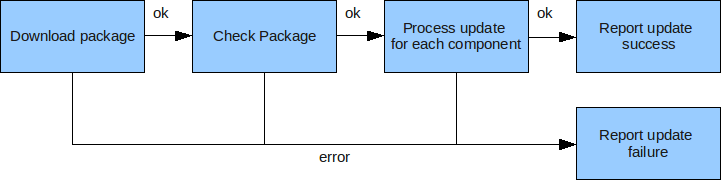

Software Update Module
======================

1. Definition
=============

Update module is the service within the Agent responsible to deal
with software update.

2. Context - Limitations
========================

The Update module is only available on **Linux** devices.\
Update module expects that Agent is run in working directory with
**no ' character** in it.

3. Functionalities
==================

The Update module can:

-   Maintain a software list
-   Support several software components and versions on each device
-   Deal with dependencies between components
-   Process [Software Update Packages](Software_Update_Package.html)
    with several components update within the same package, and
    dependencies between components
-   Reports errors to server
-   Support several protocols to retrieve update packages
-   Send software list (and information about a possible current update
    ) to server using M3DA Command ReadNode.
-   ...

4. API
======

#### 4.1. functions

~~~{.lua}
init()

Init the Update module
Mandatory to be called before doing any update, or calling any other
API.

This function is called by the agent on boot when Update is activated in
agent config.
~~~

~~~{.lua}
getstatus(sync)

Retrieves the status of the last update done or the status of current
update is an update is in progress.
 Using the sync parameter, the function can be requested to be blocking
to wait for the end of current update if any.

Returns:

-   "in_progress" if an update is in progress but blocking behavior was
    not requested
-   "ok" in case of success of the last update process
-   nil, error string describing the error that happened during
    processing the last update.
~~~

~~~{.lua}
localupdate(path, sync)

Triggers an update using a local file as update package. The local file
to use can given as parameter or will be pick in drop folder.
 Using the sync parameter, the function can be requested to be blocking
to wait for the end of the whole update process.
 Returns:

-   "in_progress" if the package was accepted (package analysis
    returned no error) but blocking behavior was not requested
-   "ok" in case of success of the whole update process if blocking
    behavior was requested
-   nil, error string describing the error that happened while doing the
    update (an error can appear either before or during package analysis
    or during package processing if blocking behavior was requested)
~~~

#### 4.2. data tables

Those data tables contain a great part of the state of the Update
module.

##### 4.2.1. data tables access

There are ways to access them:

1.  directly from module API:

~~~~{.lua}
local updatec = require"agent.update.common"
p(updatec.data.swlist)
...
~~~~

2.  remotely using ReadNode command (see [Device
    Management](Device_Management.html))\
     The target path of the command has to be:

-   "@sys.update" to get all available data: sw\_list and eventually
    currentupdate and failedupdate
-   "@sys.update.table_name" where table\_name is the name of the exact
    table to retrieve.

##### 4.2.2. data tables content

-   **swlist**\
    This table contains the software inventory: there are 2 main part :
    global information, and components information.

~~~~{.lua}
-- data.swlist.lastupdatestatus= (integer) result code of last update job
-- data.swlist.lastupdateerrstr= (string) description of the error (if any) for last update
-- data.swlist.components: (table) contains "installed"/"provisionned" software components
-- data.swlist.components[uid] (table) contains the description of a component
-- data.swlist.components[uid].name: string
-- data.swlist.components[uid].uid: unique id of the component
-- data.swlist.components[uid].version (string) version of this component
-- data.swlist.components[uid].provides (table) with features provided by this components
-- data.swlist.components[uid].depends (table) with features/components needed by this components
-- data.swlist.components[uid].parameters: (table) with parameters given in update package at install time
-- data.swlist.components[uid].force (boolean) whether this component was installed using dependency checking
~~~~

Here is a small sample:

~~~~{.lua}
:updatec.data.swlist
{
   lastupdatestatus = 200,
   appuid = 7,
   components = {
      [0] = {
         uid = 0,
         name = "platform",
         force = true,
         provides = {
            RadioHardware = "MC8705",
            Agent = "0.7 - Build: 7063",
            AleosSoftware = "4.2.5.005",
            AleosHardware = "12180306000700000000000000000000",
            RadioSoftware = "T1_0_4_3CAP R460 CNSZXD00000128 2011/11/15 10:22:30" },
         version = "N/A" },
      [7] = {
         version = "testversion",
         uid = 7,
         name = "@sys.appcon.serial_modbus_test",
         parameters = {
            purge = false,
            autostart = true } } },
   lastupdateerrstr = "All components successfuly updated" }
~~~~

-   **currentupdate**\
     This table contains information about the current update job, if
    any.\
     For instance, the manifest file received within the update package
    is stored in that table during each update job.\
     This table is **flushed** (set to **nil**) when the current job is
    **finished**.

5. Protocols
============

The Update module can use several protocol to retrieve update package.

#### 5.1. M3DA update command

See SoftwareUpdate command in [Device Management
commands](Device_Management.html)

6. Update package Process
=========================

They must conform with [Software Update Package
Format](Software_Update_Package.html).

The workflow is quite simple, and can be illustrated like this:\
 

The following sections give more details about each step.

#### 6.1. Delivery using M3DA Command

SoftwareUpdate command description in [Device Management
commands](Device_Management.html) gives some clues, but package
hosting is still to be defined.

#### 6.2. Software update package process in Update Module

When some Software Update Package has been downloaded, Update module
will be alerted and then:

-   Update module will uncompress the archive file
-   Update module will parse the whole Manifest file
-   Update module will check for Manifest information consistency:
    -   Invalid field value
    -   Components dependencies checks
    -   Update package must contain all the files/folders listed in
        Manifest 'location' field(s).

If the update package seems correctly built, the Update module can
process with each update.\
 This means that Update module will alert all the components responsible
for processing each update.

There is two types of update, the **target path** will be used to
**differentiate** them:

1.  Agent internal update feature\
     Target path must be begin with : "@sys."\
     This will trigger internal update feature, see [Software Update
    Package](Software_Update_Package.html) to get more details about
    it.\
     For instance, this will be used to update application managed by
    ApplicationContainer module.
2.  **external module update**\
     Target path is the path of some asset responsible to do the
    update.\
     The application will be responsible to do the update job, this kind
    of update is targeted to application / asset that can either deal
    with it's own update, or update some third party software\
     The update package will be forwarded to the application using
    [Embedded Micro Protocol
    (EMP)](../agent_connector_libraries/Embedded_Micro_Protocol_EMP.html), and
    Racon APIs provides corresponding functionalities.\
    The application must report update execution status; so it has to
    either:
    -   handle unsupported EMP message to alert synchronously that the
        feature is not supported by the application
    -   or handle EMP Update messages, and then report
        error(asynchronously or synchronously) or
        success(asynchronously) using EMP protocol specification.

Rq. Choice of update type may be done on a case by case basis. For
example, OSGI bundle update is likely to be done with type \#2 because
OSGI framework is responsible to update OSGI bundles.

#### 6.3. Update of each component

As previously stated, Update module forward the update of each component
to asset application or install script execution.

Those information can be useful to develop the application or the
install script

-   the install script will remain at the exact location it is set in
    the update package, but it's running directory cannot be assumed to
    be the same.
-   the location of extraction of the update package on the device
    cannot be known before the update is actually processed, but will be
    given dynamically:
    -   to the asset, as parameter of the EMP command
    -   to the install script, as parameter of the script

-   The data resulting of the extraction of the update package
    (including the install script itself; if any) will be erased once
    the install status is returned.\
     -\> it is the responsibility of the install script or application
    to copy the files needed by the application to a different location.

##### 6.3.1. Retries and Timeout

The aims of those retries and timeout is:

-   to enable the delivery of SoftwareUpdate messages to assets that
    start after the beginning of the update
-   to deal with asset that provoke target/Agent reboot on
    SoftwareUpdate message reception
    -   with predefined number of reboot during update process of a
        component
    -   systematic reboot on SoftwareUpdate message reception is managed

-   to deal with asset that restarts regularly during update process,
    but without provoking restart of the Agent
-   to deal with asset responsible for several components update
-   to deal with asset that correctly receive SoftwareUpdate messages
    but never answer to it

In order to achieve those goals, there are the mechanisms used for
retries and timeout:

-   after some retries without SoftwareUpdate message answer from the
    asset, the corresponding component update is set to failed
-   after some time without SoftwareUpdate message answer from the
    asset, the SoftwareUpdate message is sent again. This is repeated
    until retry attempts are exhausted
-   if an asset interested by the update of a component connects to
    Agent after the beginning of the update of this component, then
    the SoftwareUpdate message is sent immediately to this asset, and
    the timeout for this retry is reseted.
-   at Agent boot, if the Agent detects that an update was
    running before the reboot, the update is resumed: the component that
    was being updated but has not send update result is notified again.
    This new notification on Agent reboot counts as a retry.
-   last thing to know: retry attempts are kept over Agent reboots.

The retry number and the timeout duration can be configured using update
configuration table.

#### 6.4. Final stage and error management

The update will be successful only if all components are correctly
updated; so if any of the component update failed, the whole update job
is failed.

If an component update fails before the end:

-   Components that haven't been alerted of the update yet (i.e.
    components following the one that failed, using the components list
    order of the Manifest) will not be notified of any update.
-   Version of components that have already reported success will be
    stored

When an error occurs, the Update module will try to forward the error
description the server, depending on the realm of possibilities of the
protocol that provided the update.

Finally, when Update module can compute the overall result of the
update, it will report it to the server using the appropriate protocol.

7. Install script within Software Update Package
================================================

The install script functionality is triggered when an update package
contains a component with package field beginning by "@sys.update." like
"@sys.update.packagename".

Note: This feature will define/reference a Component that **like any
other Component**:

-   will be **referenced by the Package field** (for instance
    "@sys.update.packagename")
-   will be updated with the **same rules** about location, VersionFrom
    and VersionTo fields

#### 7.1. Content Specifications

Some constraints about install script with

-   **must** **exist** when @sys.update.package is targeted, otherwise
    Software Update will fail
-   **must** be in **lua**, in a file named **install.lua**
-   **must** be in a folder, located and named by the component location
    field
-   **must** **throw** an error to report error, either the component
    update will be assumed as **success**

example of update package with embedded install script.

~~~~{.lua}
$ ls -la package/
-rw-r--r--  1 lbarthelemy lbarthelemy    0 2009-10-29 17:30 Manifest
drwxr-xr-x  2 lbarthelemy lbarthelemy 4096 2009-10-29 17:28 HouseApp

$ cat Manifest
local update = {}
update.version = "1.2"
update.components = {
 {
  name = "@sys.update.HouseApp",
  location = "HouseApp",
  version = 1.2
 }
...
}
~~~~

~~~~{.bash}
$ ls -la HouseApp/
-rwxr--r--  1 lbarthelemy lbarthelemy    0 2009-10-29 17:30 run
-rw-r--r--  1 lbarthelemy lbarthelemy    0 2009-10-29 17:30 HouseApp
-rw-r--r--  1 lbarthelemy lbarthelemy    0 2009-10-29 17:30 another_file
-rw-r--r--  1 lbarthelemy lbarthelemy    0 2009-10-29 17:29 install.lua -> THIS IS THE FILE that will used as install script
drwxr-xr-x  2 lbarthelemy lbarthelemy 4096 2009-10-29 17:28 some_data
~~~~

#### 7.2. Running environment

The update script will be run in the Agent environment, with
**access to all functionalities**.

Furthermore, some info will be provided in a table as parameter of the
script to ease the development of the script:

-   param.cwd: running directory, likely to be the running directory of
    the Agent
-   param.script\_dir: directory where is actually stored (after package
    extraction) the install script
-   param.name : name of component without @sys, ex : update.packagename
-   param.version : version of component
-   param.parameters : (optional) a table contains parameters given by
    component in package

#### 7.3. Example

This Lua code can be put in an install.lua file in an update package.

~~~~{.lua}
-- retrieve parameter giving access to some info
local param = ...

local res,err = some_custom_action_to_do(param.script_dir)

-- check error and report it using error function
if not res then error("Error while running install scrip:"..(err or "nil")) end

--else success
~~~~

8. Local update package installation
====================================

Basic Idea: running an update job using an update package copied on the
target by the user. No need to do M3DA Command implying Platform
services server.\
 Expected usage: Initial Agent configuration, ...

-   Local update can be started at any time if no other update is
    currently running.

~~~~{.lua}
localupdate()
~~~~

-   Automatic Local update checking are done:
    -   at Agent boot
    -   at the end of any update, including at the end of local update.

-   local package need be put as a **tar archive** in
    **runtime/update/drop**folder:
    -   runtime/update/drop folder of your device can be identified by
        running the LUA command ":require'agent.update.common'.dropdir"
    -   the tar archive should have the same format as in
        [Software Update Package](Software_Update_Package.html),
        but no md5 involved
    -   Update module looks for a file named \***updatepackage.tar**\*
        file. You can change this name by setting desired name in
        config, in update.localpkgname parameter.
    -   If more than one file match this pattern, Update try to use the
        first one, ASCII order is used.

-   At the end of local update, the archive file and extract folder
    content are **deleted**

> **WARNING**
>
> Don't set config update.localpkgname parameter with a name that contains
> **'** character, if so the update will fail at update checking step.

FAQ:

-   If Update client receives an update job/package from server while
    being processing "local" package, the new update job is rejected.
    (Only one update job can occur at the same time)
-   As Update module is not responsible for update package data transfer
    in the case of localupdate, it is not responsible for data
    correctness. So no md5 check is done in this case. tar format should
    be enough anyway.
-   At the end of local update package installation, **no notification**
    is sent to any server.

#### 8.1. Example: simplest local update to do Agent provisioning

> **INFO**
>
> This Manifest file should work with out of the box (i.e. from git)
> Agent with correct **defaulconfig.lua** file

~~~~{.lua}
-- Global information
{
version = "YourInitialVersionHere",
 
-- Components information
components = {
  {
  name = "@sys.update.startupconfig",
  location = "/scripts",
  version = "componentInitialVersion"
  }
} -- end of Components information

} -- end of Manifest
~~~~

9. Error code
==============

Those codes are the error code returned by the update module.\
Those codes will also be used to acknowledge

#### Package checking errors

--------------------------------------------------------------------------------------------------------------------------------------------------------
error code            error cause                                            Meaning
----------            -------------------------------------------            ---------------------------------------------------------------------------
450                   Invalid update file name                               The absolute path of update
                                                                             file contains an invalid character " ' "

451                   Cannot parse the update file name correctly            The absolute path of update file
                                                                             isn't in good format

452                   Cannot create folder to extract update package        

453                   Cannot extract update package

454                   Cannot open manifest file                              Cannot open or find manifest file

455                   Cannot read manifest file                              The manifest file cannot be read

456                   Cannot load manifest chunk                             Cannot load the manifest file as Lua a chunk

457                   Manifest file is not valid Lua file                    There is a Lua syntax error in the manifest file

458                   Manifest file doesn't return a table                   Loading and executing manifest file doesn't return a Lua table

459                   Dependency error for a component                       This kind of error is detected by checking the dependency of the
                                                                             component in the manifest file: it has to match installed software

460                   Package protect failed

479                   Manifest error                                         This error is detected by checking the dependency, version, provide,
                                                                             format... of the components in the manifest file. It includes the error
                                                                             code number 459
--------------------------------------------------------------------------------------------------------------------------------------------------------

\ 

#### Update process errors

--------------------------------------------------------------------------------------------------------------------------------------------------------
error code            error cause                                            Meaning
----------            -------------------------------------------            ---------------------------------------------------------------------------
400                   Default internal error                                 Unexpected error is update management

461                   Too much retries for component                         Cannot send EMP commands to component (unexisting component) or
                                                                             component doesn't return a response.

462                   SoftwareUpdate command was not correctly               The EMP SoftwareUpdate command was not correctly accepted/executed by asset
                      executed by asset

463                   Alertnextcomponent error                               Error while alerting the asset: e.g. the asset is not connected

465                   Update step is not successfully finished               Cannot find the result code error while doing update steps

471                   User update callback failed                            Asset : The user update callback function has failed, a non-integrer number is
                                                                             returned in the callback function

472                   No User update callback set                            Asset : No user update callback function is set

600                   Update aborted by user request                         Asset application used update request API to abort the update
--------------------------------------------------------------------------------------------------------------------------------------------------------

\ 

#### Agent Internal updaters errors

--------------------------------------------------------------------------------------------------------------------------------------------------------
error code            error cause                                            Meaning
----------            -------------------------------------------            ---------------------------------------------------------------------------
473                   Update path is not valid                               Dispatch updaters : update path is not valid

473                   Sub path is not valid                                  Dispatch updaters : update sub path is not valid
                                                                             (no shortcut matching the path)

474                   install.lua file does not exist                        Installscript updater: there is no install.lua file at given location

475                   Cannot load install.lua script                         Installscript updater: cannot load install.lua script

476                   Script execution error                                 Installscript updater: cannot execute install.lua script

477                   ApplicationContainer is not activated                  ApplicationContainer updater cannot be run because
                                                                             ApplicationContainer is not activated

478                   ApplicationContainer updater failed                    ApplicationContainer updater failed while
                                                                             installing/uninstalling application
--------------------------------------------------------------------------------------------------------------------------------------------------------

\ 

#### Download errors

--------------------------------------------------------------------------------------------------------------------------------------------------------
error code            error cause                                            Meaning
----------            -------------------------------------------            ---------------------------------------------------------------------------
-1                    Update module is not activated                         Activation of update module can be done in RA configuration
                                                                             'agent.config.update.activate' (true or false)

551                   Wrong params in SoftwareUpdate command                 Need package url and package signature in SoftwareUpdate command

552                   Error while doing http request                         Error while doing http request to download update package, 
                                                                             all http download retries have been exhausted. 

553                   Signature mismatch for update archive                  The md5 signature of the downloaded package is different from the signature 
                                                                             sent by the server before the download.

554                   Bad update information                                 The url of the package or the signature of the package is not valid

555                   Not enough free space to download package              Free space on file system is not suficient to download the package.

557                   Unsupported protocol                                   The 'localupdate' or 'm3da' protocol is not found

558                   Update rejected by update module                       SoftwareUpdate command tries to notify a new available update to module
                                                                             update, but this command is rejected
--------------------------------------------------------------------------------------------------------------------------------------------------------

\ 

#### Internal errors

--------------------------------------------------------------------------------------------------------------------------------------------------------
error code            error cause                                            Meaning
----------            -------------------------------------------            ---------------------------------------------------------------------------
501                   Cannot get free space on device

502                   Not enough space to extract package

503                   Cannot get the number of files in package

504                   Cannot get the size of package without 
                      extracting it

505                   Malformed update data                                   Malformed update data: unknown internal error

506                   Other update was already in progress                    Other update was already in progress, only one update at the same time,
                                                                              new update is rejected

489 -> 499            project dependent error                                 These numbers represent errors in according to projets of clients, they
                                                                              are defined by application clients
--------------------------------------------------------------------------------------------------------------------------------------------------------

