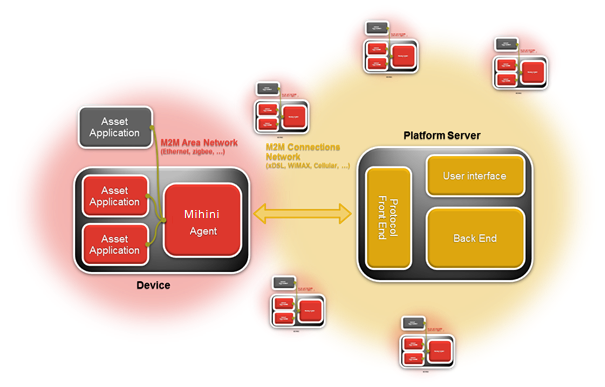
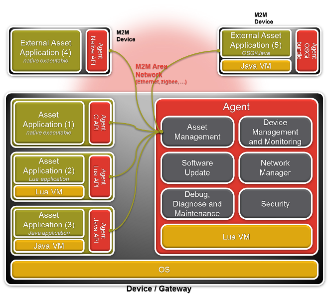

Agent UserGuide
===============

####1. Introduction

This document explains the usage of the Platform Embedded API
(Application Programming Interface). The API is planned to be available
in several programming languages and programming patterns: Lua, C and Java. The aim is to be generic, but
whenever it is necessary, language specific notes can still be present
in this document.

In order to be more concrete, a code sample for every programming
language/pattern is provided along with this document.

####2. Platform Overview

#####2.1. General Architecture

The platform enables applicative data management, device management, and
an easy way to configure a set of devices according to costumer needs.\
 The platform can be divided into two parts: the platform server and the
device side. Here is a simple representation of those two sides.

The embedded application encodes the data and events and sends them to
the embedded Agent through an IPC (e.g. a socket). The agent adds a
message envelope (compression, authentication, etc.), and sends it to
the platform server through HTTP or another transport protocol.

The platform server front-end receives and decodes it, and sends it to
the application data store where data and events will be stored.

#####2.2. Embedded Architecture

The next figure illustrates the typical embedded architecture on a Linux
target.\
This architecture is composed of the Agent, the Agent libraries,
and one or more applications.

The Agent may run in a different process (as a daemon) or be
statically linked in a monolithic software.

#####2.3. Embedded Agent

The embedded Agent is in charge of dispatching incoming messages to
applications and sending user applicative data and events to the
platform server. The exchange between applications and the Agent is
done through an IPC. This guarantees a high separation between
application code and system code.

Before sending a message to the server, the agent adds a message
envelope (compression, authentication, headers, etc.). All data received
by the Agent has to be serialized according to the protocol
specification described in 
[M3DA_Specification](http://wiki.eclipse.org/Mihini/M3DA_Specification). This serialization is done
by the Agent Connector library described below.

#####2.4. User Libraries

The user libraries is named Agent Connector libraries and addresses several
needs:

-   It enables communication with the Agent. It is an abstraction
    of the IPC used to communicate with it
-   It provides Device Management features like Agent tree access
    (including its configuration)
-   It provides data sending/receiving APIs
-   It automatically serializes the data to be sent to the Server
    through the Agent. It handles all the complexity of the 
    protocol structure
-   It abstracts system dependent features likes SMS, Reboot, etc.

####3. Racon embedded library

See [Racon embedded library page](Racon_Lua_library.html).

####4. Code Sample

The code samples show how to use the Racon Connector library in
different programming languages. The implemented application simulates
an asset called "house" with two rooms. Some data and events are sent
for those two rooms.

While starting, the asset sends an event, indicating status "booting",
and a timestamp to the server.

The bedroom temperature is sent three times, with heating preset value
(constant value here) and timestamp. An event "Temperature too hot" is
sent when the room temperature crosses an alarm threshold.

The livingroom temperature is sent five times with timestamps.\
 The event "Window opened" is also sent five times. This event is not
related to the room temperature.

A specific Command listener waits for a Command reception named
"stopheating" on the asset "house", and a trace prints the data embedded
within the received command.

The given code samples use as few as possible system calls in order to
simplify the understanding of the Racon Connector library. All
actions thus happen synchronously. \
 For the same reason, the time elapsing is basically simulated so that
timestamps are not all identical. More practical applications will use
periodic timers, event driven actions, etc.

Application Data Model:

---------------------------------------------------------------------------------------------------------------------------------------------------------------------------------------------------------------------------------------
Path                                     Data structure                                 Period and/or number of occurrence       Values                                                                                 Policy   
----                                     --------------                                 ----------------------------------       ------                                                                                 ---------------
house.event                              status, timestamp                              on boot                                  {"booting", timestamp}                                                                 "now"
                                                                                                                                                                                                                        
house.bedroom.data                       temperature, preset, timestamp                 1 sec, 3 times                           {19,19, timestamp}, {12, 19, timestamp} , {17, 19, timestamp}                          "hourly"
                                                                                                                                                                                                                        
house.bedroom.event.temptoolow           temperature, alarm\_temperature, timestamp     one time                                 {12, 19, timestamp}                                                                    "now"

house.living-room.data                   temperature, timestamp                         1 sec, 5 times                           {16, timestamp}, {17, timestamp}, {18, timestamp}, {17, timestamp}, {19, timestamp}    "hourly"
                                                                                        
house.living-room.event.windowopened     status, timestamp                              one time                                 {"open", timestamp}                                                                    "now"

---------------------------------------------------------------------------------------------------------------------------------------------------------------------------------------------------------------------------------------

> **INFO** \
> - Previous model use "data" and "event" sub paths to help in the
>   differentiation of events; this is only to improve readability of
>   the sample.\
> - A platform server model corresponding to the code sample is
>   available, and is to be provided along with the code sample source
>   code.

